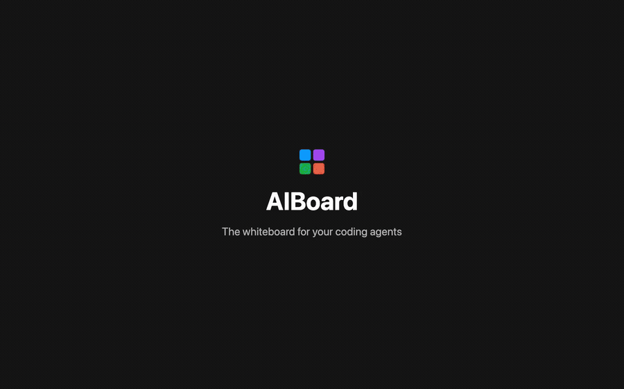
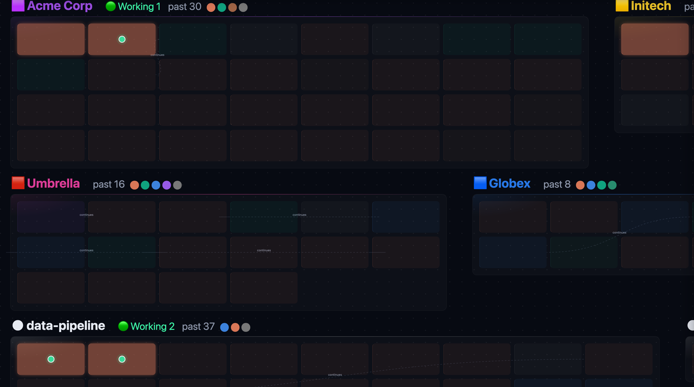

# AIBoard

**The whiteboard for your coding agents.** Every Claude Code and Codex session on one canvas, grouped by client and project, with real terminals inside. When an agent needs you, its card lights up — and your Dock tells you how many are waiting.

Native macOS · open source (MIT) · local only, no telemetry



*30-second demo, demo mode. [MP4 version](site/demo.mp4) · recorded by [`scripts/demo/record.py`](scripts/demo/record.py)*



> Working name. Screenshots use demo mode (`?demo=1`): client names, prompts and folders are fake.

## Why

One agent is easy: you watch the terminal. Many agents are not. On this Mac, right now: **19 sessions running, 11 of them waiting on a human**. Over 30 days, agents stopped and stayed stopped **1,012 times on authentication alone** (plus 509 usage limits) — silently, because a stopped agent prints nothing, and macOS notifications turn out to have been denied on this machine the whole time.

AIBoard does not start work for you. It **picks up the sessions you already have**, decides what state each one is in from published sources (the Claude hook, Codex's rollout, `claude agents --json`, terminal output), and gives you **one next action** per session — with the conversation on the left and a real terminal on the right. What differs from task-runner style tools, and where it loses to them, is written down in **[docs/why.md](docs/why.md)** (Japanese), with the measurements behind each claim.

## Install

```sh
git clone https://github.com/AI-Driven-School/aiboard && cd aiboard
./make_app.sh          # builds and installs /Applications/AIBoard.app
```

Requirements: macOS 13+, Xcode command line tools (Swift 5.9+), Python 3. A signed build and `brew install --cask` come with the first release.

## What it does

| | |
|---|---|
| **See** | Each running Claude Code / Codex session is a card. Squares are clients, dots are models. *Now* shows only what is running; *History* adds the last 30 days. |
| **Notice** | Red = stuck on a permission or question. Yellow = replied, your turn. Green = working. Your Dock badge counts them and macOS notifies you. |
| **Act** | Click a card: the conversation opens as a chat (you on the right, the agent on the left, tool runs as thin centre lines) with one input line. When the agent is waiting, Yes / No buttons appear, and a small floating panel lets you answer even from another app. Double-click, or *Open in terminal*, to work in the real terminal (libghostty) on the right. |
| **Left ⇄ right** | The conversation on the left and the terminal on the right always point at the same session: opening a conversation switches the terminal to it (without stealing your keyboard), and the terminal's tab strip carries the same name, colour and badge as the card. Click a tab to bring its conversation up on the left; right-click to close it. ⌃⌘1…9 jump to a tab. |
| **Start** | ⌘T Claude · ⌥⌘T Codex · ⇧⌘W Claude in a new git worktree · ⇧⌘R restore last terminals · ⇧⌘] / ⇧⌘[ next / previous terminal |
| **Projects** | A frame is a project. *Project* on a frame opens its brief, its handover note and everything that happened in it. Both are handed to every terminal you open there — Claude as `--append-system-prompt-file`, Codex as its first message. *Delegate* takes one line of work, picks an agent that is not at its usage limit (another signed-in Claude account, or Codex) and starts it with the same context. |
| **Loops & tools** | A session waiting on `/loop` shows *Looping · next 02:12* and is not counted as your turn. Scheduled prompts (CronCreate) show their next run. Each card counts the skills and MCP servers it used; Settings lists your skills and each MCP server's connection state (needs auth / failed). |
| **Usage** | Per account, how much the 5-hour and 7-day windows have used — counted from your own transcripts (requests and tokens), because no official usage figure exists anywhere (checked 2026-09-19: the CLI has no `usage` command and transcripts only record a limit once you hit it). The ceiling is learned from the usage recorded the last time you hit the limit, so the percentage is labelled as an estimate. |
| **Other CLIs** | Gemini, Grok and Cursor keep no state file, so AIBoard reads the one thing that does exist: whether the terminal is still printing. Output within 5s = working; nothing for 30s = your turn, with the reason spelled out. |
| **Limits & accounts** | When a session hits a usage limit, its card turns purple with the reset time, and you can continue the same conversation on another signed-in account. |
| **Grouping** | Frames come from your clients (`~/.aiboard/clients.json`), the project folder, or — for sessions started from `~` — the folder the touched files live in. Settings → *Grouping* lets you override the name, colour and client of each one; it can also copy a prompt for your own agent to propose them, and take the JSON back. AIBoard itself sends nothing. |
| **Memory** | The memory button lists sessions largest first. *Interrupt* sends Esc; *Quit* (click twice) ends the agent — the terminal stays and History can resume it. |

AIBoard is the terminal: it opens a shell on the right at launch, and ⌘T / ⌥⌘T start Claude or Codex there. Sessions you already have running elsewhere still show up on the board (found by tty, iTerm today), and *Open in terminal* brings them over: the agent in the other terminal is quit and the same conversation resumes in AIBoard, with a confirmation — and for a session mid-task, an interrupt first.

### Controls

Two-finger scroll pans · pinch or ⌘-scroll zooms · Space-drag pans · ⇧1 fit all · ⇧2 zoom to selection · 0 = 100% · `? Tour` replays the 5-step guide.

## How it works

```
AIBoard.app (Swift/AppKit)
 ├─ board: WKWebView → board server on 127.0.0.1:8791 (Python, bundled)
 │    reads ~/.claude (Claude Code session files + an optional hook)
 │    reads ~/.codex  (Codex's own state DB and rollout files)
 │    index: ~/.aiboard/index.db (SQLite, last 30 days)
 └─ terminals: libghostty surfaces, one per pane
```

- **State detection.** Claude Code: a hook writes the current activity per session (`board/hooks/tab-status.py`). Codex: the turn boundaries in its rollout file (`task_started` / `task_complete` / error).
- **Your data.** Everything the app writes lives in `~/.aiboard/` (index, logs, pane list). Client colours are yours to define in `~/.aiboard/clients.json` (see `board/clients.example.json`).

## Privacy: local by default

- The board server listens on `127.0.0.1` only, checks `Host` and `Origin`, and rejects cross-site writes.
- A second opt-in exception, also off by default: the **judge** (Settings). Pick-one decisions — which waiting session to show first, which client a session belongs to — are made by rules. You can switch them to a local model (127.0.0.1 only, e.g. LM Studio) or to an external decision model (e.g. TypeSafe Jev via OpenRouter). External sends titles, the start of requests and folder names with key-shaped strings masked — never the full conversation, but client and project names do leave the Mac — and the key is read from `AIBOARD_JUDGE_KEY` in the environment, never stored. `scripts/prove-local-only.sh` prints which judge is active.
- **git badges** (Settings, off by default): the branch badge runs `git` locally and sends nothing. The PR badge runs `gh pr view` — that asks GitHub with the branch name, using gh's own login — so it is a separate switch. Both are printed by the proof script.
- One opt-in exception, off by default: **Remote (same Wi-Fi only)** in Settings. Turning it on binds the board server to the LAN and lets a device that knows the generated key open `/m` — a small page listing what is waiting and answering it. Be clear about what that means: an answer is text typed into that agent's terminal, so whoever holds the key can instruct your agents. Treat the key like a password; regenerate it by turning Remote off and on. On a phone, "Add to Home Screen" makes it open full-screen like an app; no store, no account, no relay server. Away from home, reach the Mac over your own VPN (Tailscale, WireGuard) and open the same URL — Settings lists the Tailscale address when one exists. Nothing else is reachable remotely (no stopping, starting, or settings), and nothing goes through an outside server. `scripts/prove-local-only.sh` prints whether it is on.
- The board page is served with a Content-Security-Policy of `default-src 'self'; connect-src 'self'` — the browser engine itself blocks any request from the page to another host. (This covers the page, not the Python board server or the processes it starts; those are what the measurement below watches.)
- Secrets that appear in transcripts (API keys, tokens) are masked before display.
- **Measured, not proven:** `scripts/prove-local-only.sh` samples every socket of the app and the board server once a second (a connection shorter than a second can be missed). On 2026-09-18, 90 s with a clean config: **0 connections to anything other than this Mac**. Run it yourself.
- Not counted: the agents you run inside the terminals (Claude Code, Codex) talk to their own APIs — that is them, not AIBoard. If you add `remote_hosts` to `~/.aiboard/config.json`, the board uses `ssh` to those hosts, because you asked it to.

## Testing

`python3 scripts/uat/run_uat.py` runs the acceptance tests ([docs/uat/test-cases.md](docs/uat/test-cases.md)) against a separate board server on port 8793. It never sends input to or stops your real sessions: those requests are intercepted, and the real-signal test only targets a process the test started itself.

## Status

Early. Built and used daily by one person running many agents across clients. Known gaps: Mac only; no cloud or team features; Codex approvals are not detected yet.

## License

MIT
